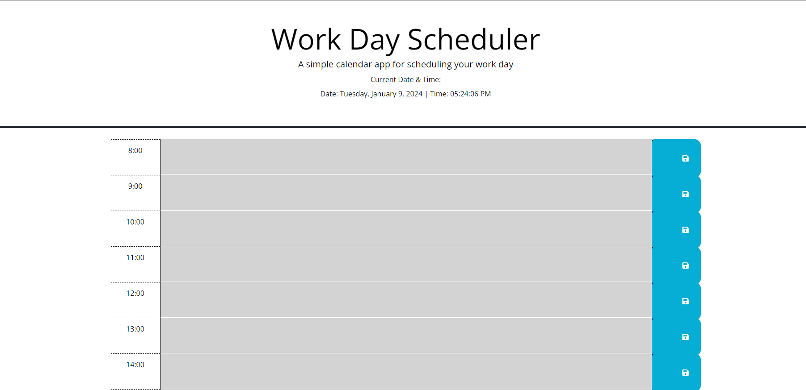
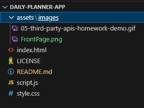

# Third-Party APIs: Daily Planner App

## Overview
This project is a fully functional Daily Planner App that empowers users to efficiently manage their busy schedules. It seamlessly combines advanced JavaScript, DOM manipulation, and the Day.js library to provide a smooth and intuitive experience. The app boasts dynamically updated HTML and CSS, all powered by jQuery.

## Getting Started
The application has already been created and deployed. You can access it by visiting [https://embleem.github.io/daily-planner-app/](#) or alternatively download the code to edit.



## Features
1. **Current Day Display:**
   - The app automatically displays the current day at the top of the calendar when accessed.

2. **Business Hours Timeblocks:**
   - Timeblocks for standard business hours are readily available as users scroll down.

3. **Intuitive Color-coded Timeblocks:**
   - Timeblocks are color-coded to indicate whether they represent past, present, or future events.

4. **Effortless Event Entry:**
   - Users can easily input events by clicking on the desired timeblock.

5. **Local Storage Event Saving:**
   - Events are automatically saved to local storage when users click the save button in a timeblock.

6. **Persistent Events:**
   - Events persist between page refreshes, ensuring data continuity.

## Technologies Used
- HTML
- CSS
- JavaScript
- jQuery
- [Day.js](https://day.js.org)

## How to Download and Use the Code
### Prerequisites
1. Ensure that you have a code editor installed on your machine, such as [Visual Studio Code](https://code.visualstudio.com/) or [Atom](https://atom.io/).

### Steps
1. **Clone the Repository:**
    ```bash
    git clone https://github.com/embleem/daily-planner-app.git
    ```
2. **Navigate to the Project Directory:**
    ```bash
    cd daily-planner-app
    ```
3. **Open in Code Editor:**
    ```bash
    code .
    ```
    This command opens Visual Studio Code. If you're using a different code editor, replace `code` with the appropriate command.
4. **Explore the Code:**
   - Familiarize yourself with the project structure, including HTML, CSS, and JavaScript files.
5. **Run the App:**
    - Open the `index.html` file in your browser to use the Daily Planner App locally.

### Notes
- Make sure you have an internet connection when opening the app in your browser, as it may rely on external libraries or APIs.
- If there are any dependencies, follow the instructions in the README or documentation.

Now you have the Daily Planner App code on your machine and can explore, modify, or use it for your own purposes!

## Project Structure
- **index.html:** Main HTML file for the application.
- **style.css:** Stylesheet for the application.
- **script.js:** JavaScript file containing the logic for the Daily Planner App.



## How to Use the Application
1. Simply visit [https://embleem.github.io/daily-planner-app/](#) in your browser.
2. The current day is prominently displayed at the top of the calendar.
3. Scroll down to view and interact with timeblocks representing standard business hours.
4. Click on a timeblock to input an event.
5. Save your event by clicking the dedicated save button.
6. Your events will persist even if you refresh the page.

## License
This project is licensed under the [MIT License](LICENSE).

## Authors
- Emma Blencowe
- https://github.com/embleem

## Libraries Used
1. Bootstrap:
https://getbootstrap.com/
2. JQuery:
https://jquery.com/
3. JavaScript Day.js:
https://day.js.org/docs/en/display/format
4. Day.js:
https://day.js.org

## References/Research
1. CSS grids:
https://www.w3schools.com/css/css_grid.asp
2. Scheduler Example with code:
https://codesandbox.io/p/sandbox/work-day-scheduler-zozvj?file=%2Fsrc%2Findex.js
3. Youtube Tutorial on similar scheduler project works:
https://www.youtube.com/watch?v=sm6py49QNto
4. Bootstrap Grids information:
https://getbootstrap.com/docs/5.3/layout/grid/
5. Bootstrap Scheduler Examples:
https://demos.devexpress.com/Bootstrap/Scheduler/ViewTypes.aspx
6. JavaScript Date() Constructor - 
https://www.w3schools.com/jsref/jsref_constructor_date.asp
7. JavaScript getDay() Method - 
https://www.w3schools.com/jsref/jsref_getday.asp
8. Notes on Bootstrap:
https://medium.com/@urchykli/nested-grids-using-bootstrap-8673b6bd7ec3

## Acknowledgements
1. Thank you to ThomasCalle (www.github/ThomasCalle) for sharing a youtube tutorial on how the scheuler works.
2. Thank you to Rockey Willemse for the support and help with code when I got stuck!